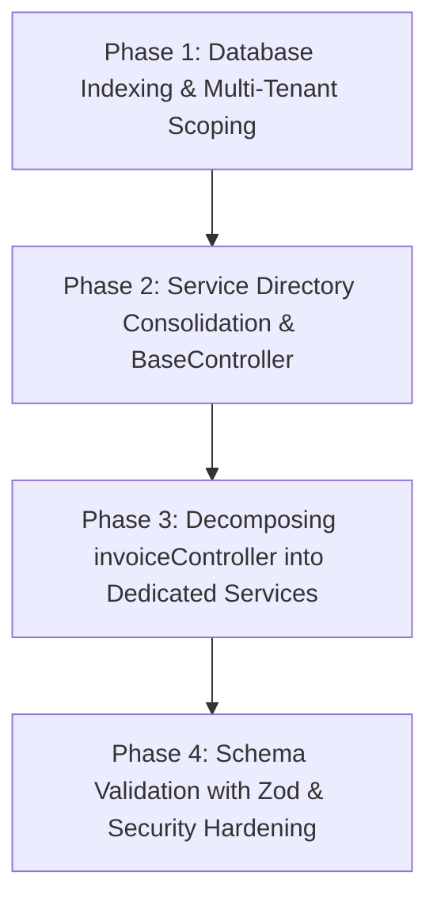

# 🏛️ WarrantyDesk Backend & Database Architecture Review

> **Role & Standard**: Senior Backend Architect, Database Optimizer & Reliability Engineer  
> **Date**: September 2026  
> **Scope**: Controllers, Services, Models, Database Indexing, Security, Multi-Tenancy, and Scalability  

---

## 📑 Executive Summary

| Category | Current Status | Target Production Pattern | Impact & Benefit |
| :--- | :--- | :--- | :--- |
| **Layered Architecture** | Dual folders (`service/` & `services/`), monolithic controller (`invoiceController.js` at ~3,060 lines) combining DB queries, PDF generation, and external APIs. | Unified Clean Layered Architecture (`routes → controllers → services → repositories → models`) with thin controllers. | 🚀 High maintainability, testability, and separation of concerns. |
| **Database & Multi-Tenancy** | Child models (`ServiceSchedule`, `ServiceVisit`) lack direct `shop_id`; unpaginated `$lookup` before `$match` in aggregations. | Denormalize `shop_id` on child tables, add compound indexes, paginate before `$lookup`. | ⚡ Up to 10x-50x faster queries, zero cross-tenant query leaks. |
| **Input Validation & Security** | Manual `if (!req.body.field)` checks, `Object.assign` mass assignment risk, fallback JWT secret, unprotected auth routes. | Schema validation (Zod/Joi), strict DTO sanitization, rate-limited auth endpoints. | 🔒 Eliminates mass-assignment and brute-force vulnerabilities. |
| **Error Handling & State** | In-memory `tempPdfStore` Map (cluster/multi-instance unsafe), inconsistent `try/catch` blocks, unstructured `console.error`. | Centralized AppError + `asyncHandler`, Redis/S3-backed temporary files or signed URLs, structured logging. | 🛡️ High reliability, horizontal scalability across PM2/Docker. |

---

## 1. 🗄️ Database & Query Performance Optimizations

### 1.1. Critical Multi-Tenant Bug in `dashboardService.js`
In `backend/service/dashboardService.js`:
```javascript
// ❌ DANGEROUS: Queries across ALL shops globally before populating shop_id
ServiceVisit.find({ deleted_at: null })
  .sort({ createdAt: -1 })
  .limit(limit)
  .populate({
    path: "service_schedule_id",
    populate: {
      path: "service_plan_id",
      match: { shop_id: shopId },
      populate: { path: "customer_id", select: "full_name" }
    }
  });
```
* **Problem**: If other shops generate visits, this query fetches visits belonging to *other tenants*, filters them out in Node.js, and returns an empty or truncated list for the current shop!
* **Optimization**: Add `shop_id` directly to `ServiceSchedule` and `ServiceVisit` models and index `{ shop_id: 1, deleted_at: 1, createdAt: -1 }`.

```javascript
// ✅ OPTIMIZED: Direct, fast, tenant-isolated index scan
ServiceVisit.find({ shop_id: shopId, deleted_at: null })
  .sort({ createdAt: -1 })
  .limit(limit)
  .populate({
    path: "service_schedule_id",
    populate: { path: "customer_id", select: "full_name" }
  })
  .lean();
```

---

### 1.2. Heavy `$lookup` Before Filter in `InvoiceController.getInvoices`
In `backend/controllers/invoiceController.js`:
* **Problem**: The aggregation pipeline performs `$lookup` on `customers`, `users`, and `invoiceitems` for **every** invoice of the shop *before* applying search filters, sorting, `$skip`, and `$limit`. This forces MongoDB to build large document trees in RAM.
* **Optimization**:
  1. For queries without customer/item text search: **Filter and paginate `Invoice` collection first**, then `$lookup` only the 10–50 sliced results.
  2. For multi-entity text search: Query matching Customer/Product IDs first or utilize index-backed compound search.

```javascript
// ✅ OPTIMIZED PIPELINE: Slice first, join second
const pipeline = [
  { $match: matchCriteria }, // Uses compound index { shop_id: 1, deleted_at: 1, invoice_date: -1 }
  { $sort: { invoice_date: -1 } },
  { $skip: skip },
  { $limit: parseInt(limit) },
  // Lookups run ONLY on the paginated (10-50) documents:
  {
    $lookup: {
      from: "customers",
      localField: "customer_id",
      foreignField: "_id",
      as: "customer"
    }
  },
  { $unwind: { path: "$customer", preserveNullAndEmptyArrays: true } },
  {
    $lookup: {
      from: "invoiceitems",
      localField: "_id",
      foreignField: "invoice_id",
      as: "invoice_items"
    }
  }
];
```

---

### 1.3. Memory Bloat & Large `$in` in `ProductController.getProducts`
In `backend/controllers/productController.js`:
* **Problem**: `ServicePlan.distinct("invoice_item_id")` and `ServiceSchedule.distinct(...)` pull tens of thousands of raw ObjectIDs into Node.js heap memory, perform set operations in JS, and pass massive `$in: [...]` arrays back to MongoDB.
* **Optimization**: Use single aggregation pipelines or indexed joins rather than loading entire distinct ID arrays into application RAM.

---

### 1.4. Index Audit & Recommended Composite Indexes

Add the following compound indexes to guarantee fast query plan execution:

| Collection | Recommended Compound Index | Target Query / Endpoint |
| :--- | :--- | :--- |
| **`Invoice`** | `{ shop_id: 1, deleted_at: 1, invoice_date: -1 }` | `getInvoices`, Dashboard Revenue Trends |
| **`Invoice`** | `{ shop_id: 1, deleted_at: 1, payment_status: 1, due_date: 1 }` | Overdue Invoice Alerts & Stats |
| **`InvoiceItem`** | `{ shop_id: 1, deleted_at: 1, createdAt: -1 }` | `getProducts` list & search |
| **`InvoiceItem`** | `{ shop_id: 1, deleted_at: 1, warranty_end_date: 1 }` | Upcoming Warranty Expirations |
| **`Customer`** | `{ shop_id: 1, deleted_at: 1, createdAt: -1 }` | `getCustomers` paginated list |
| **`ServiceSchedule`** | `{ shop_id: 1, deleted_at: 1, status: 1, scheduled_date: 1 }` | Service Reminder Cron & Dashboard |

---

### 1.5. Production Database Connection Pooling
In `backend/config/mongoose.js`:
```javascript
// ✅ PRODUCTION-READY MONGOOSE SETUP
import mongoose from "mongoose";

export const MongoDb = async () => {
  try {
    const conn = await mongoose.connect(process.env.MONGODB_URI, {
      maxPoolSize: 50,             // Support concurrent load
      minPoolSize: 10,             // Keep warm connections ready
      serverSelectionTimeoutMS: 5000,
      socketTimeoutMS: 45000,
    });

    mongoose.connection.on("error", (err) => {
      console.error("MongoDB connection error:", err);
    });

    mongoose.connection.on("disconnected", () => {
      console.warn("MongoDB disconnected. Attempting reconnect...");
    });

    console.log(`✅ MongoDB Connected: ${conn.connection.host}`);
    return conn;
  } catch (error) {
    console.error("❌ MongoDB connection failed:", error);
    throw error;
  }
};
```

---

## 2. 🏗️ Architecture & Code Layering

### 2.1. Consolidate `backend/service/` and `backend/services/`
* **Issue**: Splitting services across `service/` and `services/` causes confusion and circular imports.
* **Action**: Standardize everything into `backend/services/`.

---

### 2.2. Decompose the ~3,060-Line `invoiceController.js`
Deconstruct the monolithic controller into dedicated domain modules:

```
backend/
├── controllers/
│   ├── invoiceController.js          # (HTTP validation, response formatting)
│   ├── paymentController.js          # (Payment records & reminders)
│   └── servicePlanController.js      # (Service schedule updates)
├── services/
│   ├── invoiceService.js             # (Core invoice CRUD & transactions)
│   ├── invoiceSequenceService.js     # (Authoritative numbering logic)
│   ├── invoicePDFService.js          # (PDF rendering & Cloudinary upload)
│   ├── invoiceNotificationService.js # (WhatsApp & MSG91 message delivery)
│   └── paymentService.js             # (Payment calculations & history)
```

---

### 2.3. Introduce `BaseController` and `asyncHandler` Pattern
Avoid repeating `try / catch / res.status(500)` blocks in every controller method:

```javascript
// utils/asyncHandler.js
export const asyncHandler = (fn) => (req, res, next) => {
  Promise.resolve(fn(req, res, next)).catch(next);
};
```

```javascript
// controllers/baseController.js
export class BaseController {
  sendSuccess(res, data = {}, message = "Success", statusCode = 200) {
    return res.status(statusCode).json({
      success: true,
      message,
      data,
    });
  }

  sendPaginated(res, { items, page, limit, total }, message = "Success") {
    return res.status(200).json({
      success: true,
      message,
      data: {
        items,
        pagination: {
          page: Number(page),
          limit: Number(limit),
          total,
          pages: Math.ceil(total / limit),
        },
      },
    });
  }
}
```

---

## 3. 🛡️ Security, Input Validation & Reliability

### 3.1. Guard Against Mass Assignment in Update Endpoints
In `backend/controllers/customerController.js`:
```javascript
// ❌ RISKY: Allows client to overwrite _id, shop_id, deleted_at, etc.
Object.assign(customer, payload);
```
```javascript
// ✅ SECURE: Whitelist editable fields
const ALLOWED_UPDATES = [
  "full_name", "whatsapp_number", "email", "alternate_phone",
  "address", "date_of_birth", "anniversary_date", "gst_number",
  "customer_type", "preferred_language", "notes"
];

ALLOWED_UPDATES.forEach((field) => {
  if (payload[field] !== undefined) {
    customer[field] = payload[field];
  }
});
```

---

### 3.2. Multi-Instance Safe PDF Delivery
In `backend/controllers/invoiceController.js`:
* `const tempPdfStore = new Map()` stores PDF buffers in Node.js process heap memory.
* **Failure mode**: In multi-instance or clustered setups (e.g., PM2 cluster, Docker replicas), the recipient or webhook hitting another process fails to locate the buffer.
* **Solution**: Use Cloudinary secure signed URLs or shared Redis storage for temporary buffers.

---

### 3.3. Apply Rate Limiting to Sensitive Routes
In `backend/index.js`, ensure auth and external endpoints are protected by `rateLimiter.js`:
```javascript
import { authLimiter, apiLimiter } from "./middleware/rateLimiter.js";

app.use("/v1/auth/login", authLimiter);
app.use("/v1/auth/register", authLimiter);
app.use("/v1/", apiLimiter);
```

---

## 4. 📋 Phased Refactoring Roadmap



1. **Phase 1: Zero-Risk Database Indexing & Tenant Isolation Fix**
   - Add missing compound indexes on `Invoice`, `InvoiceItem`, `Customer`, `ServiceSchedule`.
   - Fix `ServiceVisit` query scoping in `dashboardService.js`.
2. **Phase 2: Directory Consolidation & Standard Error Boundaries**
   - Merge `service/` into `services/`.
   - Implement `BaseController` and `asyncHandler` error boundary.
3. **Phase 3: Controller Refactoring & Decoupling**
   - Extract `invoiceSequenceService`, `invoiceNotificationService`, and `invoicePDFService` out of `invoiceController.js`.
   - Convert memory-intensive `distinct` queries in `ProductController` into database pipelines.
4. **Phase 4: Input Validation & Security Hardening**
   - Implement Zod schema validation across all request endpoints.
   - Guard against mass-assignment on all `update*` controller methods.
